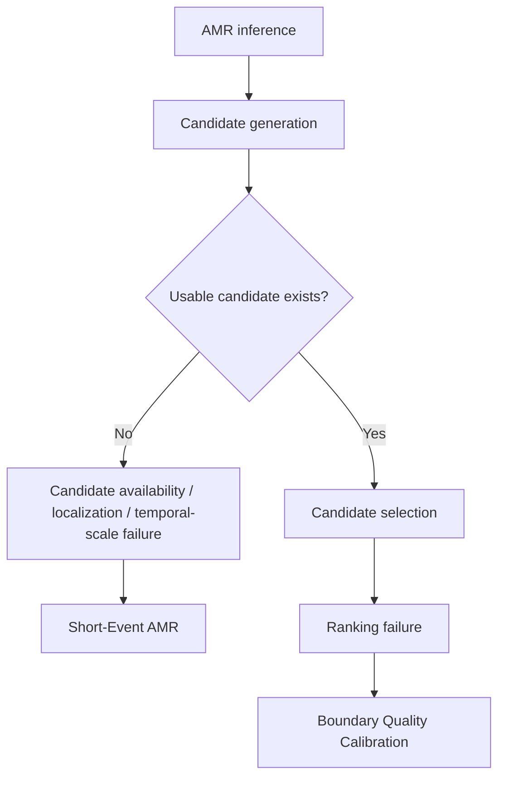

# Short-Event AMR

An open, continuously updated research archive for diagnosing short-event
failures in audio moment retrieval (AMR), with DCASE 2026 Task 6 as the
primary benchmark.

The project asks a deliberately narrow question before proposing a new
method: **where does localization fail for short events, and what evidence is
available at each stage of the baseline pipeline?** The repository therefore
keeps diagnostic experiments, fixed experiment cards, provenance, negative
results, and reproducible analysis code together.

## Research question

Why do short-duration audio moments disproportionately fail under strict temporal retrieval metrics? The archive separates candidate availability, localization, temporal scale, and ranking so each stage can be examined with fixed data and recorded provenance.

## Research story



The two projects address adjacent stages of the same pipeline. Short-Event AMR asks why a usable candidate is absent or poorly scaled; Boundary Quality Calibration asks whether the system can select a usable candidate correctly.

## Evidence summary

- The public archive contains an inference-only duration-mechanism audit of the unchanged official QD-DETR baseline over 1,347 queries.
- The coordinate-preserving counterfactual did not support a generic global-search or monotonic dose-response explanation, but it did support a matched high-saliency distractor effect. The follow-up hard-negative mechanism audit finds a decoder-reference-attraction signal, while native semantic-competitor evidence is not dominant on the available raw-audio subset.
- The audits distinguish candidate availability and localization from candidate selection. A candidate may be absent or poorly scaled for a short event, while a usable candidate can still be ranked incorrectly.
- Proposal-level temporal signals are used to study candidate generation and recall. They are not semantic event labels or human-validated explanations.

## Cross-model evidence

Historical archive comparisons include more than one AMR architecture and have mixed outcomes. They bound the claim to the tested pipeline and do not establish architecture-independent generalization.

## Controlled interventions

Completed diagnostic pilots and specified counterfactuals are kept with their controls and status. Some recorded interventions change localization behavior across duration regimes, while the coordinate-preserving decoder-access counterfactual supports only a matched high-saliency distractor effect. These records do not establish a causal mechanism or a deployable method.

## Relationship to Boundary Quality Calibration

[Boundary Quality Calibration](https://github.com/Prum0107/Boundary-Quality-Calibration-for-Audio-Moment-Retrieval) studies the downstream selection question: when a usable candidate already exists, can its score reflect temporal boundary quality? Short-Event AMR studies the upstream availability, localization, and temporal-scale question: why is a usable candidate missing or poorly scaled? Neither project subsumes the other.

## Current status

- The official QD-DETR baseline has been audited in an inference-only
  duration-mechanism study on 1,347 queries.
- The latest audit supports a matched high-saliency distractor effect and a
  decoder-reference-attraction component, but it does not establish a single
  cause or justify a new AMR method.
- The native local MS-CLAP validation is a separate gate. The full 1,347-query
  native audit has not been run; the hard-negative audit uses only the raw WAVs
  available on the server and marks the remaining native comparisons BLOCKED.
- The coordinate-preserving decoder-access counterfactual is complete. It
  supports a matched high-saliency distractor effect, but not a general
  global-search or monotonic search-space dose-response explanation.
- The GT-vs-hard-negative mechanism audit is complete as an inference-only
  diagnostic. It supports a decoder-reference-attraction component, partially
  supports near-GT geometry, and leaves repeated/unannotated occurrences
  unresolved because the prepared human-review labels are blank.

See [`docs/roadmap.md`](docs/roadmap.md) and the archived experiment cards for
the current decision state.

## Repository map

```text
audits/       Versioned diagnostic reports, tables, summaries, and experiment cards
baseline/     Recovered official QD-DETR baseline source without model assets
code/         Selected analysis scripts used by the diagnostic studies
docs/         Research protocol, provenance, roadmap, and archive index
legacy_tsel/  Earlier TSEL/AMR implementation and paper-facing analysis code
paper/        Manuscript drafts, experiment timeline, and compact result tables
third_party/  Notices and upstream provenance for imported code
```

The repository intentionally does not contain raw audio, extracted feature
tensors, model checkpoints, private server information, or runtime caches.
Those artifacts are large, data-dependent, or not cleared for redistribution.
Their locations, hashes, and reproduction requirements are recorded in
[`docs/provenance.md`](docs/provenance.md) where possible.

## Reproducibility principles

1. Every non-trivial diagnostic starts with an experiment card.
2. Diagnostic studies do not silently modify QD-DETR, retrain a probe, learn a
   projection, or change the scoring rule after inspecting results.
3. Claims are scoped to the representation and access path that was actually
   measured. Native local MS-CLAP evidence is not treated as proof about the
   stored temporal features consumed by QD-DETR.
4. Full-population audits follow a successful small-scale validation gate.
5. Large or restricted artifacts are reconstructed from their recorded
   provenance rather than committed to Git.

## Environment

The code is Python-based. A CUDA environment is recommended for model-backed
audits; documentation-only checks work on CPU. The legacy implementation
contains its own dependency specification in
[`legacy_tsel/requirements.txt`](legacy_tsel/requirements.txt).

The current audit reports are directly readable without installing the model.
To reproduce a model-backed run, obtain the benchmark metadata, features, and
checkpoint under the applicable dataset and model licenses, then follow the
run-specific instructions in the corresponding audit directory.

## License and data

Original project materials in this repository are released under the MIT
License. Imported legacy materials retain the notice in
[`legacy_tsel/LICENSE`](legacy_tsel/LICENSE). Dataset metadata, pretrained
models, extracted features, and third-party source remain subject to their
respective licenses; this repository does not relicense them.

## Ongoing work

Issues and pull requests should identify the experiment ID, the exact source
commit/checkpoint used, whether an experiment was pre-specified, and the
resulting claim ceiling. See [`CONTRIBUTING.md`](CONTRIBUTING.md).
